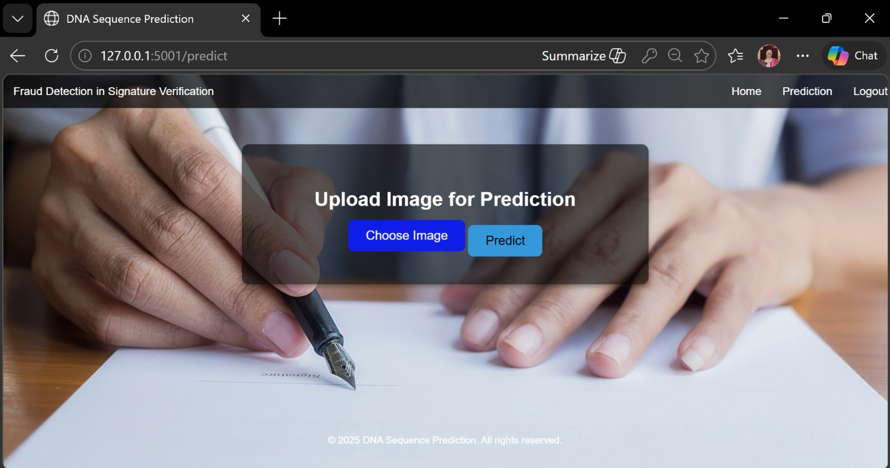
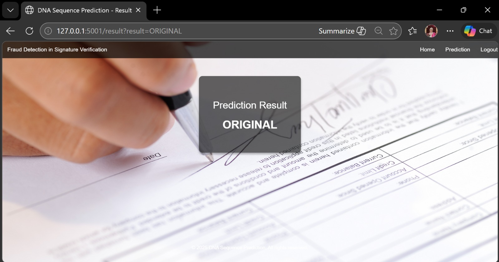

# Fraud Detection in Signature Verification Using Advanced Image Processing Techniques for Real-Time Authentication

An AI-powered handwritten signature verification system designed to detect fraudulent signatures using advanced image processing, machine learning and deep learning techniques in real time.

---

## 🚀 Features

- Real-time signature verification
- Fraudulent vs genuine signature detection
- CNN-based feature extraction
- Machine learning prediction system
- Interactive web interface using Flask
- Upload and verify signatures instantly
- Authentication-focused intelligent analysis

---

## 🛠 Tech Stack

- Python
- Flask
- Machine Learning
- Deep Learning
- OpenCV
- HTML
- CSS
- JavaScript

---

## 📂 Project Structure

```bash
Signature-Detection/
│
├── app.py
├── requirements.txt
├── signature-rf.pkl
├── signature_cnn_model.h5
│
├── screenshots/
│   ├── Home_Page.jpeg
│   ├── Prediction_Page.jpeg
│   └── Result_Page.jpeg
│
├── static/
│   ├── img/
│   └── js/
│
├── templates/
│   ├── index.html
│   ├── login.html
│   ├── predict.html
│   ├── result.html
│   └── charts.html
│
└── Test/
```

---

## ⚙️ Installation

### Clone the Repository

```bash
git clone https://github.com/SyedaJuveriya/Signature-Detection.git
```

### Navigate to Project Folder

```bash
cd Signature-Detection
```

### Install Dependencies

```bash
pip install -r requirements.txt
```

### Run the Application

```bash
python app.py
```

---

## 📸 Screenshots

### 🏠 Home Page


---

### 🔍 Prediction Page



---

### 📊 Result Page



---

## 📊 Model Highlights

- Deep learning based signature analysis
- Intelligent feature extraction
- Real-time prediction workflow
- Fraud detection oriented architecture
- Authentication-focused system design

---

## 🌟 Future Enhancements

- Cloud deployment
- Multi-user authentication
- Enhanced dataset training
- Real-time camera-based verification
- Improved fraud analysis accuracy

---

## 👩‍💻 Author

### Syeda Juveriya

AI & Data Science Undergraduate  
Machine Learning | Deep Learning | Python

- LinkedIn: https://www.linkedin.com/in/syedajuveriya/
- GitHub: https://github.com/SyedaJuveriya

---

## ⭐ Support

If you like this project, consider giving it a star ⭐
